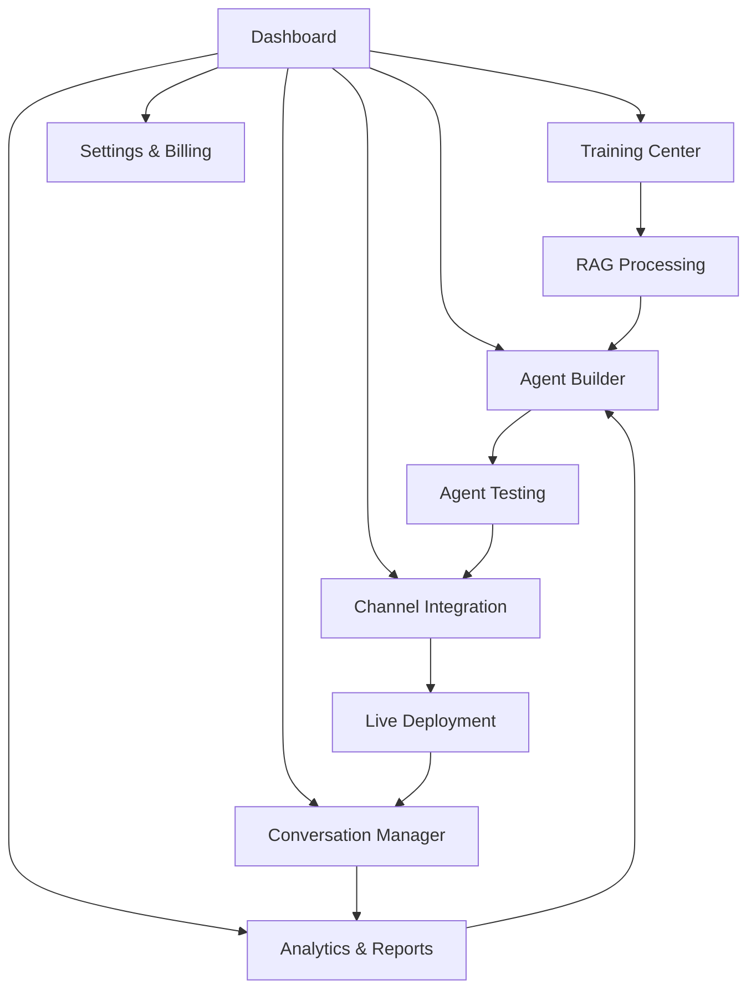

# AIgentable - Multi-Tenant AI Agent Platform

## 1. Product Overview
AIgentable is a comprehensive multi-tenant SaaS platform that enables businesses to create, deploy, and manage custom AI agents for various business roles including sales, customer service, and support across multiple communication channels.

The platform leverages RAG (Retrieval-Augmented Generation) technology with ChromaDB for vectorization, allowing AI agents to be trained on specific business data. The solution provides omnichannel integration with WhatsApp, Facebook, Instagram, Telegram, and website widgets, making it a complete AI-powered customer engagement solution.

Target market: Small to medium businesses seeking to automate customer interactions and scale their customer service operations efficiently. The platform is designed for acquisition-ready scalability with modern tech stack and clean architecture.

## 2. Core Features

### 2.1 User Roles
| Role | Registration Method | Core Permissions |
|------|---------------------|------------------|
| Platform Admin | System access | Full platform management, tenant oversight, system configuration |
| Tenant Admin | Business registration | Tenant management, agent creation, data training, analytics |
| Tenant User | Invitation by admin | Agent interaction, basic configuration, conversation monitoring |
| End Customer | No registration | Chat with AI agents through various channels |

### 2.2 Feature Module
Our AIgentable platform consists of the following main pages:
1. **Dashboard**: tenant overview, agent performance metrics, conversation analytics, quick actions.
2. **Agent Builder**: AI agent creation, personality configuration, role assignment, training data upload.
3. **Training Center**: business data upload, RAG system management, knowledge base organization, vector database status.
4. **Channel Integration**: omnichannel setup, WhatsApp/Facebook/Instagram/Telegram configuration, website widget generator.
5. **Conversation Manager**: real-time chat monitoring, conversation history, agent handover controls.
6. **Analytics & Reports**: performance metrics, conversation insights, business intelligence dashboard.
7. **Settings & Billing**: tenant configuration, subscription management, user management, API keys.

### 2.3 Page Details
| Page Name | Module Name | Feature description |
|-----------|-------------|---------------------|
| Dashboard | Overview Panel | Display key metrics including active agents, conversation volume, response accuracy, and tenant health status |
| Dashboard | Quick Actions | Provide shortcuts to create new agents, upload training data, and access recent conversations |
| Dashboard | Performance Metrics | Show real-time analytics with charts for conversation trends, agent effectiveness, and channel performance |
| Agent Builder | Agent Creation | Create custom AI agents with personality settings, role definitions, response tone, and business context |
| Agent Builder | Configuration Panel | Set agent parameters including response length, creativity level, fallback behaviors, and escalation rules |
| Agent Builder | Testing Interface | Test agent responses with sample conversations and fine-tune behavior before deployment |
| Training Center | Data Upload | Upload business documents, FAQs, product catalogs, and training materials in various formats |
| Training Center | RAG Management | Process uploaded data through vectorization, manage knowledge base chunks, and monitor training status |
| Training Center | Knowledge Organization | Categorize and tag training data, set data priorities, and manage data versioning |
| Channel Integration | Platform Setup | Configure integrations with WhatsApp Business API, Facebook Messenger, Instagram Direct, and Telegram Bot API |
| Channel Integration | Widget Generator | Create customizable chat widgets for website embedding with styling options and deployment codes |
| Channel Integration | Channel Management | Monitor channel status, manage API credentials, and configure channel-specific behaviors |
| Conversation Manager | Live Monitoring | View real-time conversations across all channels with agent response tracking and customer satisfaction |
| Conversation Manager | History & Search | Access conversation archives with advanced search, filtering, and export capabilities |
| Conversation Manager | Handover Controls | Manage agent-to-human handover triggers, escalation workflows, and manual intervention options |
| Analytics & Reports | Performance Dashboard | Analyze agent effectiveness, response times, resolution rates, and customer satisfaction scores |
| Analytics & Reports | Business Intelligence | Generate insights on customer behavior, common queries, and optimization recommendations |
| Analytics & Reports | Export & Reporting | Create custom reports, schedule automated reports, and export data for external analysis |
| Settings & Billing | Tenant Configuration | Manage tenant settings, branding customization, and operational preferences |
| Settings & Billing | Subscription Management | Handle billing, plan upgrades, usage monitoring, and payment processing |
| Settings & Billing | User Management | Add/remove users, set permissions, manage API access, and configure security settings |

## 3. Core Process

**Tenant Admin Flow:**
1. Register and set up tenant account with business information
2. Upload business data and training materials to the Training Center
3. Create custom AI agents using the Agent Builder with specific roles and personalities
4. Configure omnichannel integrations for desired communication platforms
5. Test agents and deploy them across configured channels
6. Monitor conversations and agent performance through the Dashboard
7. Analyze performance and optimize agents based on analytics insights

**End Customer Flow:**
1. Initiate conversation through any integrated channel (WhatsApp, website widget, etc.)
2. Interact with AI agent for business inquiries, support, or sales
3. Receive contextual responses based on business-specific training data
4. Escalate to human agent if needed through automated handover triggers

## 4. User Interface Design

### 4.1 Design Style
- **Primary Colors**: Deep blue (#1E40AF) for trust and professionalism, bright green (#10B981) for success states
- **Secondary Colors**: Light gray (#F8FAFC) for backgrounds, dark gray (#374151) for text
- **Button Style**: Rounded corners (8px radius) with subtle shadows and hover animations
- **Font**: Inter font family with 14px base size for body text, 16px for buttons, 24px+ for headings
- **Layout Style**: Card-based design with clean spacing, top navigation with sidebar for main sections
- **Icons**: Heroicons style with consistent 20px size, using outline style for navigation and solid for actions

### 4.2 Page Design Overview
| Page Name | Module Name | UI Elements |
|-----------|-------------|-------------|
| Dashboard | Overview Panel | Grid layout with metric cards, color-coded status indicators, responsive charts using Chart.js |
| Dashboard | Quick Actions | Floating action buttons with icons, modal dialogs for quick tasks, breadcrumb navigation |
| Agent Builder | Agent Creation | Step-by-step wizard interface, form validation, preview panels, drag-and-drop personality traits |
| Training Center | Data Upload | Drag-and-drop file upload area, progress bars, file type icons, batch processing status |
| Channel Integration | Platform Setup | Toggle switches for channel activation, credential input forms, connection status indicators |
| Conversation Manager | Live Monitoring | Real-time chat interface, conversation threads, agent/human indicators, search and filter bars |
| Analytics & Reports | Performance Dashboard | Interactive charts, date range pickers, metric comparison tools, export buttons |

### 4.3 Responsiveness
The platform is desktop-first with mobile-adaptive design. Touch interaction optimization is implemented for mobile devices, with responsive breakpoints at 768px (tablet) and 1024px (desktop). The interface adapts gracefully across devices while maintaining full functionality on all screen sizes.