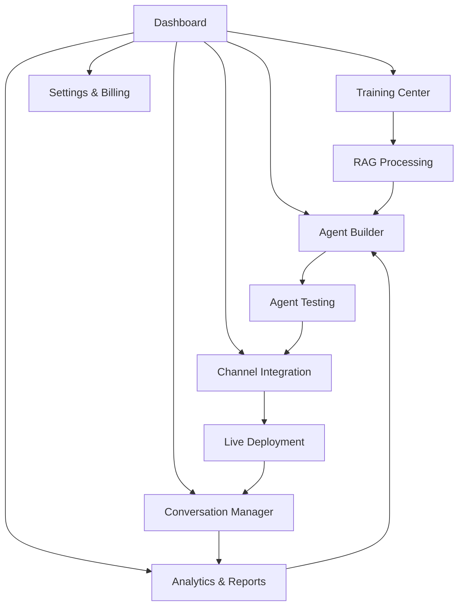

# AIgentable - Multi-Tenant AI Agent Platform

## 1. Product Overview

AIgentable is a comprehensive multi-tenant SaaS platform that enables businesses to create, deploy, and manage custom AI agents for various business roles including sales, customer service, and support across multiple communication channels.

The platform leverages LangChain framework for advanced AI orchestration, with enhanced RAG (Retrieval-Augmented Generation) technology using ChromaDB for vectorization. LangChain provides standardized AI provider management, sophisticated chain-based message processing, and future-ready agent workflows. The solution offers omnichannel integration with WhatsApp, Facebook, Instagram, Telegram, and website widgets, making it a complete AI-powered customer engagement solution.

Target market: Small to medium businesses seeking to automate customer interactions and scale their customer service operations efficiently. The platform is designed for acquisition-ready scalability with modern tech stack, clean architecture, and enterprise-grade AI orchestration capabilities.

## 2. Technical Architecture & LangChain Integration

### 2.1 LangChain Implementation Strategy

The platform adopts a phased approach to integrate LangChain framework for enhanced AI capabilities while maintaining existing infrastructure:

**Phase 1: LangChain Core Integration**

* Replace custom `aiProvider.ts` with LangChain's standardized AI provider interface

* Implement LangChain's enhanced RAG capabilities with improved document loaders and text splitters

* Utilize LangChain's memory management for better conversation context handling

* Maintain compatibility with existing OpenAI and Google Generative AI integrations

**Phase 2: Message Processing Migration**

* Migrate `messageProcessor.ts` to use LangChain chains for sophisticated conversation workflows

* Implement LangChain's streaming capabilities for real-time response generation

* Enhance error handling and retry mechanisms through LangChain's built-in features

* Preserve existing Socket.io integration for real-time communication

**Phase 3: Advanced Agent Workflows (Future)**

* Evaluate LangGraph for complex multi-step agent reasoning and orchestration

* Implement human-in-the-loop workflows for agent approval and escalation

* Add support for multi-agent collaboration and hierarchical agent structures

* Maintain backward compatibility with existing agent configurations

**Infrastructure Preservation**

* Keep existing Socket.io for real-time communication and live monitoring

* Maintain Prisma ORM for database operations and data persistence

* Preserve Redis for caching, session management, and performance optimization

* Ensure ChromaDB integration continues for vector storage and retrieval

### 2.2 Benefits of LangChain Integration

* **Standardized AI Management**: Unified interface for multiple AI providers with easy switching capabilities

* **Enhanced RAG**: Improved document processing, chunking strategies, and retrieval mechanisms

* **Advanced Memory**: Sophisticated conversation memory with buffer, summary, and entity-based options

* **Tool Integration**: Easy integration of external APIs and business tools

* **Future-Proof Architecture**: Scalable foundation for advanced agent workflows and multi-agent systems

* **Cost Efficiency**: MIT-licensed open-source framework with no additional licensing costs

## 3. Core Features

### 3.1 User Roles

| Role                   | Registration Method    | Core Permissions                                                                    |
| ---------------------- | ---------------------- | ----------------------------------------------------------------------------------- |
| Platform Admin         | System access          | SaaS platform management, subscription oversight, billing management, system config |
| Business Owner/Manager | Business registration  | AI agent creation, data training, conversation management, team member invitations  |
| Team Member            | Invitation by business | Agent monitoring, conversation handling, basic configuration within organization    |
| End Customer           | No registration        | Chat with AI agents through various channels (WhatsApp, website, etc.)              |

### 3.2 Feature Module

Our AIgentable platform consists of the following main pages:

1. **Dashboard**: tenant overview, agent performance metrics, conversation analytics, quick actions.
2. **Agent Builder**: AI agent creation, personality configuration, role assignment, training data upload.
3. **Training Center**: business data upload, RAG system management, knowledge base organization, vector database status.
4. **Channel Integration**: omnichannel setup, WhatsApp/Facebook/Instagram/Telegram configuration, website widget generator.
5. **Conversation Manager**: real-time chat monitoring, conversation history, agent handover controls.
6. **Analytics & Reports**: performance metrics, conversation insights, business intelligence dashboard.
7. **Settings & Billing**: tenant configuration, subscription management, user management, API keys.

### 3.3 Page Details

| Page Name            | Module Name             | Feature description                                                                                           |
| -------------------- | ----------------------- | ------------------------------------------------------------------------------------------------------------- |
| Dashboard            | Overview Panel          | Display key metrics including active agents, conversation volume, response accuracy, and tenant health status |
| Dashboard            | Quick Actions           | Provide shortcuts to create new agents, upload training data, and access recent conversations                 |
| Dashboard            | Performance Metrics     | Show real-time analytics with charts for conversation trends, agent effectiveness, and channel performance    |
| Agent Builder        | Agent Creation          | Create custom AI agents with personality settings, role definitions, response tone, and business context      |
| Agent Builder        | Configuration Panel     | Set agent parameters including response length, creativity level, fallback behaviors, and escalation rules    |
| Agent Builder        | Testing Interface       | Test agent responses with sample conversations and fine-tune behavior before deployment                       |
| Training Center      | Data Upload             | Upload business documents, FAQs, product catalogs, and training materials in various formats                  |
| Training Center      | RAG Management          | Process uploaded data through vectorization, manage knowledge base chunks, and monitor training status        |
| Training Center      | Knowledge Organization  | Categorize and tag training data, set data priorities, and manage data versioning                             |
| Channel Integration  | Platform Setup          | Configure integrations with WhatsApp Business API, Facebook Messenger, Instagram Direct, and Telegram Bot API |
| Channel Integration  | Widget Generator        | Create customizable chat widgets for website embedding with styling options and deployment codes              |
| Channel Integration  | Channel Management      | Monitor channel status, manage API credentials, and configure channel-specific behaviors                      |
| Conversation Manager | Live Monitoring         | View real-time conversations across all channels with agent response tracking and customer satisfaction       |
| Conversation Manager | History & Search        | Access conversation archives with advanced search, filtering, and export capabilities                         |
| Conversation Manager | Handover Controls       | Manage agent-to-human handover triggers, escalation workflows, and manual intervention options                |
| Analytics & Reports  | Performance Dashboard   | Analyze agent effectiveness, response times, resolution rates, and customer satisfaction scores               |
| Analytics & Reports  | Business Intelligence   | Generate insights on customer behavior, common queries, and optimization recommendations                      |
| Analytics & Reports  | Export & Reporting      | Create custom reports, schedule automated reports, and export data for external analysis                      |
| Settings & Billing   | Tenant Configuration    | Manage tenant settings, branding customization, and operational preferences                                   |
| Settings & Billing   | Subscription Management | Handle billing, plan upgrades, usage monitoring, and payment processing                                       |
| Settings & Billing   | User Management         | Add/remove users, set permissions, manage API access, and configure security settings                         |

## 4. Core Process

**Platform Admin Flow:**

1. Access SaaS platform dashboard
2. Monitor business subscriptions and billing
3. Manage user accounts and platform settings
4. Handle business onboarding and support
5. Oversee system performance and maintenance

**Business Owner/Manager Flow:**

1. Register business and create organization account
2. Upload and manage RAG documents for knowledge base
3. Create and configure AI agents for customer service
4. Set up multi-channel integrations (WhatsApp, website, etc.)
5. Monitor customer conversations and agent performance
6. Invite team members to join organization
7. Access analytics and conversation reports
8. Manage subscription and billing settings

**Team Member Flow:**

1. Accept invitation and join business organization
2. Access assigned AI agents and customer conversations
3. Monitor and assist with customer interactions
4. Perform basic agent configurations within permissions
5. Generate conversation and performance reports

**End Customer Flow:**

1. Initiate conversation through available channels (WhatsApp, website chat)
2. Interact with AI agents for support, information, or services
3. Receive responses based on business's trained knowledge base
4. Escalate to human agent if needed through automated handover triggers

## 5. User Interface Design

### 5.1 Design Style

* **Primary Colors**: Deep blue (#1E40AF) for trust and professionalism, bright green (#10B981) for success states

* **Secondary Colors**: Light gray (#F8FAFC) for backgrounds, dark gray (#374151) for text

* **Button Style**: Rounded corners (8px radius) with subtle shadows and hover animations

* **Font**: Inter font family with 14px base size for body text, 16px for buttons, 24px+ for headings

* **Layout Style**: Card-based design with clean spacing, top navigation with sidebar for main sections

* **Icons**: Heroicons style with consistent 20px size, using outline style for navigation and solid for actions

### 5.2 Page Design Overview

| Page Name            | Module Name           | UI Elements                                                                                      |
| -------------------- | --------------------- | ------------------------------------------------------------------------------------------------ |
| Dashboard            | Overview Panel        | Grid layout with metric cards, color-coded status indicators, responsive charts using Chart.js   |
| Dashboard            | Quick Actions         | Floating action buttons with icons, modal dialogs for quick tasks, breadcrumb navigation         |
| Agent Builder        | Agent Creation        | Step-by-step wizard interface, form validation, preview panels, drag-and-drop personality traits |
| Training Center      | Data Upload           | Drag-and-drop file upload area, progress bars, file type icons, batch processing status          |
| Channel Integration  | Platform Setup        | Toggle switches for channel activation, credential input forms, connection status indicators     |
| Conversation Manager | Live Monitoring       | Real-time chat interface, conversation threads, agent/human indicators, search and filter bars   |
| Analytics & Reports  | Performance Dashboard | Interactive charts, date range pickers, metric comparison tools, export buttons                  |

### 5.3 Responsiveness

The platform is desktop-first with mobile-adaptive design. Touch interaction optimization is implemented for mobile devices, with responsive breakpoints at 768px (tablet) and 1024px (desktop). The interface adapts gracefully across devices while maintaining full functionality on all screen sizes.

## 6. LangChain Migration Implementation Plan

### 6.1 Phase 1: Core Integration (Weeks 1-3)

**AI Provider Management Enhancement**

* Install LangChain dependencies: `langchain`, `@langchain/openai`, `@langchain/google-genai`

* Create new `LangChainProvider` service to replace existing `aiProvider.ts`

* Implement standardized model switching capabilities across OpenAI and Google Generative AI

* Add enhanced error handling and retry mechanisms

* Maintain backward compatibility with existing API calls

**RAG System Enhancement**

* Integrate LangChain's document loaders for improved file processing

* Implement advanced text splitters for better chunking strategies

* Enhance vector store integration with ChromaDB through LangChain connectors

* Add support for multiple document formats and preprocessing pipelines

### 6.2 Phase 2: Message Processing Migration (Weeks 4-6)

**Chain-Based Conversation Workflows**

* Refactor `messageProcessor.ts` to use LangChain's conversation chains

* Implement `ConversationChain` for basic chat functionality

* Add `RetrievalQAChain` for RAG-enhanced responses

* Create custom chains for business-specific workflows

* Integrate streaming responses with existing Socket.io infrastructure

**Memory Management Upgrade**

* Replace custom conversation memory with LangChain's memory classes

* Implement `ConversationBufferMemory` for recent conversation context

* Add `ConversationSummaryMemory` for long conversation handling

* Create `ConversationEntityMemory` for customer-specific information retention

### 6.3 Phase 3: Advanced Features (Future Roadmap)

**LangGraph Evaluation**

* Assess LangGraph for complex agent orchestration needs

* Design multi-step reasoning workflows for advanced customer scenarios

* Plan human-in-the-loop integration for agent approval processes

* Evaluate multi-agent collaboration capabilities

**Tool Integration Framework**

* Design extensible tool integration system using LangChain's tool framework

* Plan integration with external business APIs and services

* Create custom tools for platform-specific functionality

### 6.4 Infrastructure Compatibility

**Preserved Components**

* Socket.io: Continue real-time communication for live chat and monitoring

* Prisma: Maintain database operations and schema management

* Redis: Keep caching, session management, and performance optimization

* ChromaDB: Preserve vector storage with enhanced LangChain integration

**Integration Points**

* Ensure LangChain streaming works seamlessly with Socket.io events

* Maintain Prisma integration for conversation and agent data persistence

* Preserve Redis caching for LangChain model responses and embeddings

* Keep existing API endpoints while enhancing backend processing

### 6.5 Testing & Validation Strategy

**Migration Testing**

* Create comprehensive test suite for LangChain integration

* Implement A/B testing between old and new AI processing systems

* Validate response quality and performance metrics

* Ensure backward compatibility with existing agent configurations

**Performance Monitoring**

* Monitor response times and accuracy during migration

* Track memory usage and conversation context handling

* Validate streaming performance with Socket.io integration

* Measure cost efficiency and provider switching capabilities

